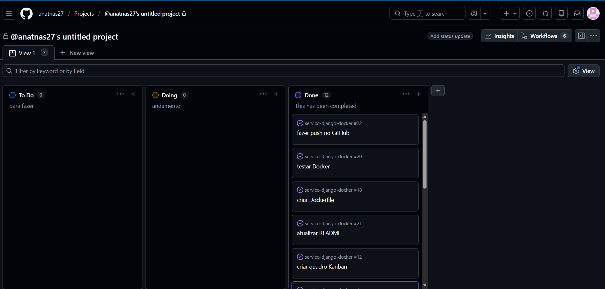

# Serviço Django Docker

Projeto desenvolvido utilizando Django, Docker e Docker Compose como parte de uma atividade prática da disciplina de DevOps. O objetivo é demonstrar a criação de um serviço web simples, sua containerização e execução utilizando Docker Compose. "Catalogo de Filmes"

## Pré-requisitos

- Docker Desktop
- Docker Compose

## Como executar

Clone o repositório:

```bash
git clone https://github.com/anatnas27/servico-django-docker.git
```

Entre na pasta do projeto:

```bash
cd servico-django-docker
```

Execute:

```bash
docker compose up --build
```

A aplicação ficará disponível em:

```
http://localhost:8000
```

## Tecnologias utilizadas

- Python
- Django
- Docker
- Docker Compose
- SQLite

## Quadro Kanban

